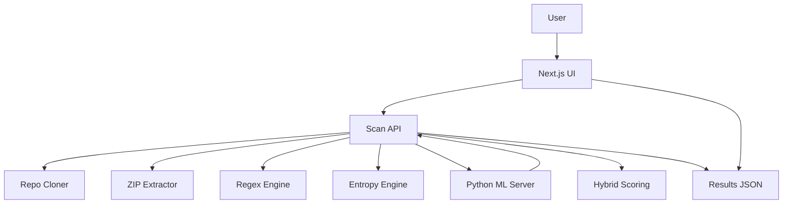
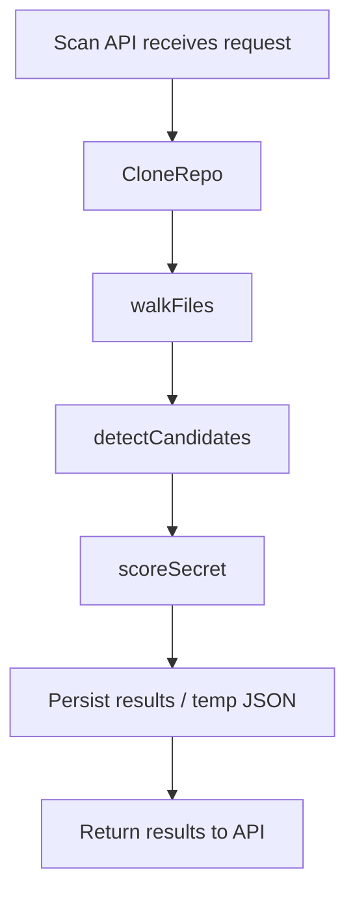
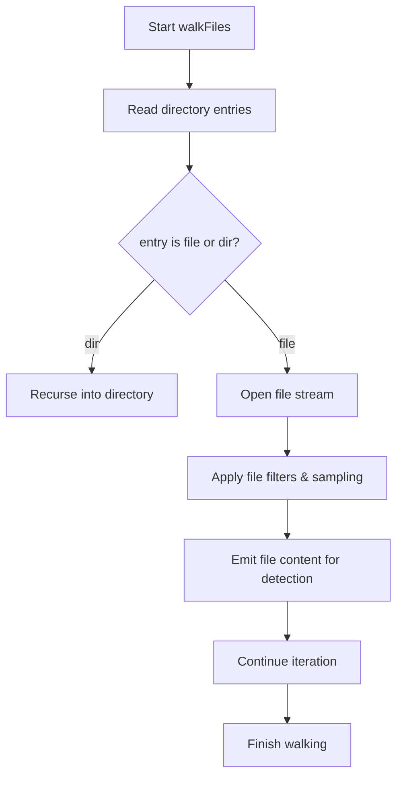
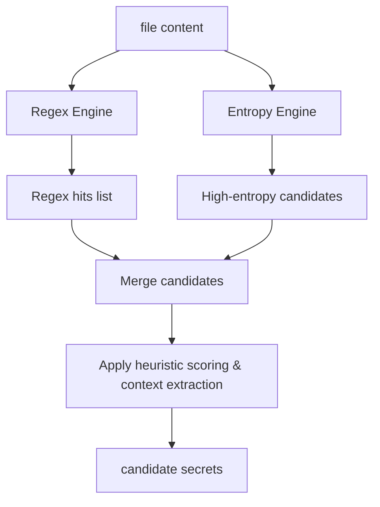
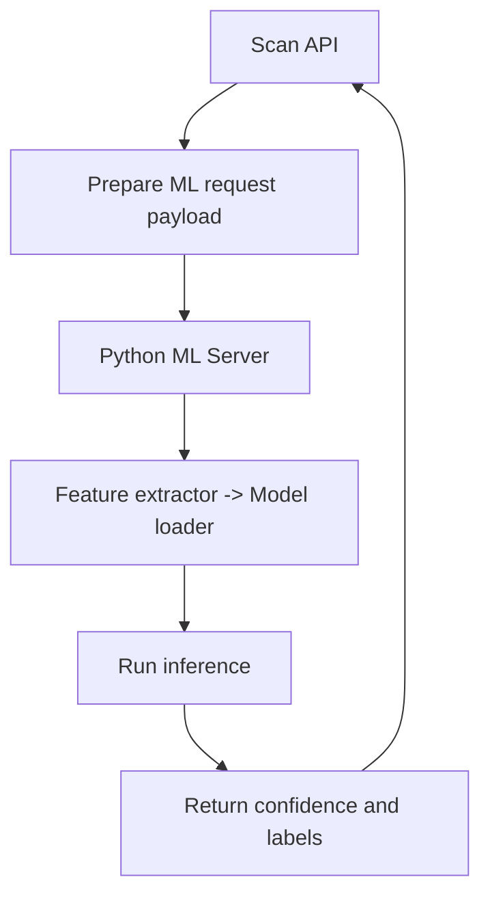

# Architecture

This document describes the high-level architecture of the Secret Detector system and individual flows for scanning repositories, detection, ML inference, scoring, and dashboard rendering. Diagrams are written with MermaidJS (flowchart TD).

## High-level system diagram



**Explanation:** The user interacts with the Next.js UI which calls Scan API endpoints. The Scan API coordinates repo cloning or ZIP extraction, runs detection engines (regex and entropy), optionally calls the Python ML server for inference, combines results with hybrid scoring logic, and returns a JSON of results which the UI renders.

## Repo cloning flow



**Notes:** `CloneRepo` performs a shallow clone or download of the target repository into the scanner workspace. `walkFiles` recursively enumerates files, filtering by size/type. `detectCandidates` applies regex + entropy heuristics to emit candidate secrets. `scoreSecret` applies hybrid scoring (ML + heuristics) and results are persisted or returned.

## File walking flow



**Notes:** The walker skips binary or huge files per configured thresholds, can sample large files (head/tail), and streams content to detection components to avoid loading everything into memory.

## Regex + entropy detection flow



**Notes:** The `Regex Engine` uses patterns from `lib/regexPatterns.ts`. The `Entropy Engine` computes Shannon entropy on possible tokens or sliding windows to find high-entropy strings. Both outputs are merged and enriched with file path, surrounding lines, and metadata for scoring.

## ML inference flow



**Notes:** ML inference is handled by a separate Python service (see `ml-backend/`) which exposes an HTTP or local IPC endpoint. The Node side prepares features using `mlClient.ts` (or sends raw candidates and lets Python extract features). The server returns probability scores and labels used by hybrid scoring.

## Hybrid scoring flow

```mermaid
flowchart TD
  Candidates[Candidates from heuristics] --> HeuristicScore[Heuristic scoring (regex weight, entropy score)]
  Candidates --> MLScore[ML probability from Python]
  MLScore --> Combine[Combine ML + heuristic scores]
  HeuristicScore --> Combine
  Combine --> Threshold[Apply thresholds & classification]
  Threshold --> FinalResult[Final scored candidate]
```

**Notes:** The hybrid scorer merges deterministic signals (pattern matches, entropy) with ML probabilities to increase precision and reduce false positives. Thresholds and weights are configurable.

## Dashboard rendering flow

```mermaid
flowchart TD
  User[User] --> UI[Next.js dashboard]
  UI --> Fetch[Fetch results JSON from API]
  Fetch --> Transform[Transform results into view model]
  Transform --> Components[Render components (SecretCard, ConfidenceMeter, Charts)]
  Components --> Interaction[User filters / explores / downloads report]
  Interaction --> API
```

**Notes:** The UI composes reusable components (`SecretCard`, `ConfidenceMeter`, histograms) and supports filtering, sorting, and exporting reports (PDF/JSON). The results JSON follows a stable schema under `types/ScanTypes.ts`.

---

If you want, I can also:
- Add an SVG export of the diagrams or embed them in README.
- Add a small image legend explaining icons and color usage.

File: `docs/architecture.md`
